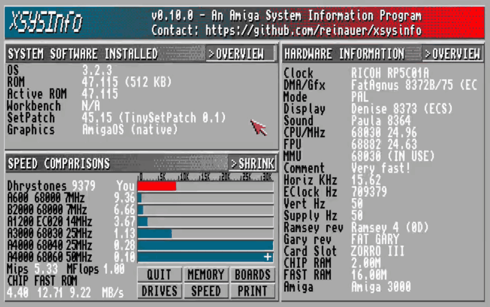
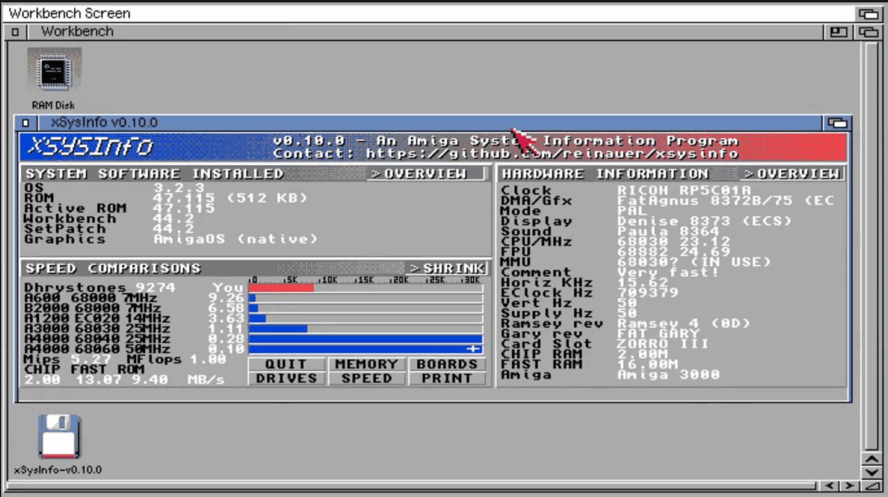

# xSysInfo



`xSysInfo` is a comprehensive system information utility designed for AmigaOS. It provides detailed insights into your Amiga system's hardware and software configuration, along with benchmarking capabilities.

**Note:** This program does not contain any code from the original AmigaOS SysInfo tool.

## Features

*   **Detailed Hardware Information**: Get in-depth reports on your CPU, memory, drives (including SCSI), expansion boards, and cache.
*   **Software Environment Overview**: View details about your AmigaOS software setup.
*   **Benchmarking**: Includes Dhrystone benchmarks to assess your system's performance.
*   **Graphical User Interface (GUI)**: User-friendly interface for easy navigation and information display.
*   **Printing Support**: Print out system reports for documentation or sharing (For now, the output is saved to a file in RAM:)
*   **Localization**: Supports multiple languages for its interface.

## Building `xSysInfo`

To build `xSysInfo`, you will need a GCC cross-compiler for m68k-amigaos (e.g., `m68k-amigaos-gcc`). The build process also requires `make`, `curl`, `md5sum`, and `lha` to handle external dependencies.

1.  **Clone the repository**:
    ```bash
    git clone https://github.com/reinauer/xsysinfo.git
    cd xsysinfo
    git submodule update --init
    ```

2.  **Build the project**:
    The Makefile will automatically handle fetching and building necessary third-party libraries (`flexcat` and `identify`).
    ```bash
    make
    ```

3.  **Create an Amiga Disk File (ADF)**:
    You can create a bootable `.adf` image containing `xSysInfo` and its necessary libraries using `xdftool`.
    ```bash
    make disk
    ```
    This will generate `xsysinfo-<version>.adf` in the project root.

## Running `xSysInfo`

The primary way to run `xSysInfo` on a real Amiga is via a GOTEK drive using the generated `xsysinfo-<version>.adf` disk image.

You can also run the ADF on an Amiga emulator (like WinUAE or FS-UAE).

Start `xSysInfo` from its Workbench icon or run it from the Shell on a real
Amiga or emulator. With no command-line options, it opens the graphical
interface.

### Command-line options

Use `xSysInfo [options]`. Options are case-insensitive keywords, entered
without a leading dash.

| Option | Description |
| --- | --- |
| `BRIEF` | Run benchmarks and write a compact summary to Shell output. |
| `FULL` | Run CPU, memory, and drive benchmarks and write the complete text report to Shell output. |
| `WHICH` | Write a column-aligned system report compatible with the WhichAmiga 1.3.3 text format to Shell output. |
| `DARK` | Use the dark blue palette in the graphical interface. The default is the gray palette. |
| `DEBUG` | Enable diagnostic output. Debugging is off by default. |

`BRIEF`, `FULL`, and `WHICH` run without opening the graphical interface.
If more than one report mode is supplied, `FULL` takes precedence over
`WHICH`, which takes precedence over `BRIEF`. `DEBUG` can be combined with
any mode; `DARK` affects only the graphical interface.

For example, open the interface in dark mode or save a full report to RAM:

```text
xSysInfo DARK
xSysInfo FULL >RAM:xSysInfo.txt
```

### Graphical interface

The System Software Installed tile opens on an overview of the OS, physical
ROM, active ROM, Workbench, SetPatch, and graphics system. Its cycle button
opens the library, device, resource, and MMU lists. Total Chip and Fast RAM
are shown in the hardware overview.

## Workbench icon ToolTypes

These settings are read from the program's icon when xSysInfo starts from
Workbench. Edit the icon's ToolTypes, with one entry per line. The supplied
icon contains `DISPLAY=auto`.

| ToolType | Description |
| --- | --- |
| `DISPLAY=auto` | Default. Open a window if the detected Workbench screen is wider than 640 pixels or taller than 512 pixels; otherwise use a separate PAL or NTSC screen. |
| `DISPLAY=window` | Open a window on the Workbench screen. |
| `DISPLAY=screen` | Open a separate PAL or NTSC screen. |
| `DARK` | Use the dark blue palette. Omit this entry to use the default gray palette. |
| `DEBUG` | Enable diagnostic output. Omit this entry to leave debugging off. |

Use one `DISPLAY` entry to select the display mode. Add `DARK` or `DEBUG`
as separate entries to enable either option.




## Dependencies

`xSysInfo` uses the following third-party projects and data:

*   [FlexCat](https://github.com/adtools/flexcat): Builds the localization
    catalogs from the source submodule.
*   [Identify](http://identify.shredzone.org/): Identifies hardware and
    software. Developer headers come from the source submodule; the runtime
    library comes from
    [IdentifyUsr.lha](https://aminet.net/util/libs/IdentifyUsr.lha).
*   [IdentifyPci.lha](https://aminet.net/util/libs/IdentifyPci.lha): Supplies
    the `pci.db` identification database included on the disk image.
*   [openpci68k.lha](https://aminet.net/driver/other/openpci68k.lha): Supplies
    `openpci.library` for PCI device access.
*   [MMULib.lha](https://aminet.net/util/libs/MMULib.lha): Supplies
    `mmu.library` and the 68020/68030/68040/68060 support libraries included
    on the disk image.
*   [MuManual.lha](https://aminet.net/docs/misc/MuManual.lha): Supplies MMU
    developer headers and function descriptions used to generate compiler
    bindings.
*   [TinySetPatch](https://github.com/reinauer/TinySetPatch): Built from the
    source submodule for CPU support and system initialization when booting
    the disk image.
*   [fd2pragma](https://github.com/AmigaPorts/fd2pragma): Generates compiler
    bindings from library function descriptions and C prototypes. Must be
    preinstalled and available on `PATH`; the build does not install it.

The build downloads and caches the `.lha` archives in `downloads/`. It also
downloads `fd2pragma.types` to `~/.fd2pragma.types` when that file is missing.

## Contributing

xSysInfo is licensed under the [BSD 2-Clause License](LICENSE).
Contributions are welcome! Fork the repository, make your changes, and
submit a pull request.
